# Sistema de Entrega de Alimentos

> **Sistema integral para el control de entrega de alimentos a estudiantes**

---

## Stack Tecnológico

<table>
  <thead>
    <tr>
      <th width="150px">Componente</th>
      <th>Tecnología</th>
      <th width="100px">Versión</th>
    </tr>
  </thead>
  <tbody>
    <tr>
      <td><strong>Backend</strong></td>
      <td><code>PHP</code></td>
    </tr>
    <tr>
      <td><strong>Frontend</strong></td>
      <td><code>HTML5</code> + <code>CSS3</code></td>
    </tr>
    <tr>
      <td><strong>Base de Datos</strong></td>
      <td><code>MySQL</code></td>
    </tr>
  </tbody>
</table>

---

## Progreso del Desarrollo

```mermaid
gantt
    title Cronograma de Desarrollo
    dateFormat  X
    axisFormat %s
    
    section Diseño
    Planificación    :done, des1, 0, 1
    
    section Backend  
    Base de Datos    :active, des2, 1, 2
    Desarrollo PHP   :des3, 2, 3
    
    section Frontend
    HTML/CSS         :des4, 3, 4
    
    section Testing
    Pruebas          :des5, 4, 5
```

<strong>Estado Actual del Proyecto</strong>

### Checklist de Tareas

- [x] **Planificación y diseño**
- [ ] **Implementación de Base de Datos**
- [ ] **Desarrollo Backend PHP**
- [ ] **Desarrollo Frontend**
  - [ ] Interfaces de usuario
- [ ] **Testing**
---

## Características Principales

- Diseño y normalización de BD
- Consultas SQL 
- Desarrollo web con PHP
